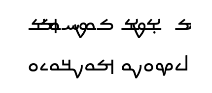

# Mandaic Web Font

This is the web font version of [Noto Sans Mandaic](https://fonts.google.com/noto/specimen/Noto+Sans+Mandaic).

## Firefox Bug

- There is a bug in Firefox that prevents this font from being displayed properly.

- You need to use this web font along with the [font face](https://developer.mozilla.org/en-US/docs/Web/CSS/@font-face) feature in CSS to make it work.

```css
@font-face {
  font-family: "Noto Sans Mandaic";
  src: url(notosansmandaic-regular-webfont.woff2) format("woff2"), url(notosansmandaic-regular-webfont.woff) format("woff");
}

body {
  font-family: "Noto Sans Mandaic";
}
```

## Example

- You can see the bug in the 1st paragraph as illustrated below.

- The 2nd paragraph uses the **@font-face** feature mentioned above to properly display your text.

- The latest versions of Chrome and Safari do not have this bug.

